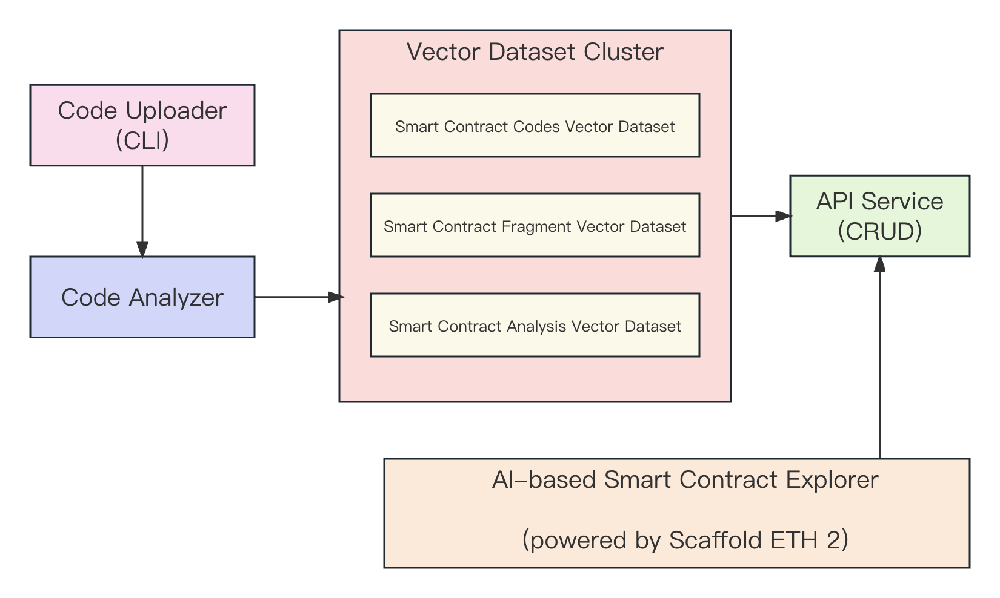

# 🏗 AI-based Smart Contract Explorer

<h4 align="center">
  <a href="https://smart-contract-explorer.movespace.xyz/">Lanuch App</a>

  <a href="https://mumbai.polygonscan.com/address/0x9d4716dc798ceac7e40b0b692e7a2fc3a353c4b1">smart contract on Mumbai Network</a>
  <a href="https://app.embedbase.xyz/datasets/f2e0aabc-a506-4217-8570-4c888d3d3556">VectorDB about Ethereum Smart Contract</a>
  <a href="https://app.embedbase.xyz/datasets/7740d47b-8ce1-4ae7-8256-049b01fa034d">VectorDB about Ethereum Smart Contract Sliced</a>
  <a href="https://app.embedbase.xyz/datasets/e4276331-4582-463b-85be-abc8b21ad739">VectorDB about Ethereum Smart Contract Sliced</a>
</h4>

🧪 AI-based Smart Contract Explorer 是一个 基于向量数据库和 LLM 进行 ETH 智能合约代码检索的浏览器，搜索结果包含智能合约原文、出处、代码解析等多维度内容。向量数据库技术是人工智能应用中的一项重要技术，通过 ANN 最似近邻算法，我们可以通过自然语言进行联想式搜索，而非传统的关键字搜索。立项起因是传统搜索代码的浏览器，例如 Etherscan，仅能搜索出原始代码。我们希望通过 AI 赋能，建立关于智能合约代码的全维度搜索，让合约开发者的效率指数倍增。


## Quickstart

如果您想快速体验我们的功能请通过：<a href="https://smart-contract-explorer.movespace.xyz/">Lanuch App</a>

## Frontend
### Requirements

Before you begin, you need to install the following tools:

- [Node (v18 LTS)](https://nodejs.org/en/download/)
- Yarn ([v1](https://classic.yarnpkg.com/en/docs/install/) or [v2+](https://yarnpkg.com/getting-started/install))
- [Git](https://git-scm.com/downloads)

To get started with AI-based Smart Contract Explorer, follow the steps below:

1. Clone this repo & install dependencies

```
git clone https://github.com/NonceGeek/ai-based-smart-contract-explorer.git
cd ai-based-smart-contract-explorer
yarn install
```

2. Run a local network in the first terminal:

```
yarn chain
```

This command starts a local Ethereum network using Hardhat. The network runs on your local machine and can be used for testing and development. You can customize the network configuration in `hardhat.config.ts`.

3. On a second terminal, deploy the test contract:

```
yarn deploy
```

This command deploys a test smart contract to the local network. The contract is located in `packages/hardhat/contracts` and can be modified to suit your needs. The `yarn deploy` command uses the deploy script located in `packages/hardhat/deploy` to deploy the contract to the network. You can also customize the deploy script.

4. On a third terminal, start your NextJS app:

```
yarn start
```

Visit your app on: `http://localhost:3000`. You can interact with your smart contract using the contract component or the example ui in the frontend. You can tweak the app config in `packages/nextjs/explorer.config.ts`.

Run smart contract test with `yarn hardhat:test`

- Edit your smart contract `VectorDBProposalGovernancer.sol` in `packages/hardhat/contracts`
- Edit your frontend in `packages/nextjs/pages`
- Edit your deployment scripts in `packages/hardhat/deploy`
## Reference

如果您想了解数据流的实现，请先下载我们实现的client：<a href="https://github.com/NonceGeek/movespace_db_uploader_cli/blob/main/movespace_db_uploader_cli">movespace_db_uploader_cli</a>

#### 请确保使用变量“EMBEDBASE_KEY” 将您获取的app_key存储在dotenv（.env）中

参数列表和类型：
```
 [path: :string, embedbaseid: :string, type: :string, insert: :boolean, delete: :boolean, metadata: :string],
```
参数别名：
```
f: :filepath, e: :embedbaseid, t: :type, i: :insert, d: :delete, m: :metadata
```
使用格式：
```
./movespace_db_uploader_cli --type [mddoc, code] --path [the_path_for_content] --metadata [the_path_for_metadata] --embedbaseid [embedbase_id] --insert
```
使用事例：

```
$ ./movespace_db_uploader_cli --type mddoc --path example_data/eth/analysis/erc20.md --metadata example_data/eth/analysis/erc20.json --embedbaseid eth-smart-contracts-analysis --insert
$ ./movespace_db_uploader_cli --type code --path example_data/eth/sliced/erc20.json --embedbaseid eth-smart-contracts-sliced --insert
```


## Architecture



